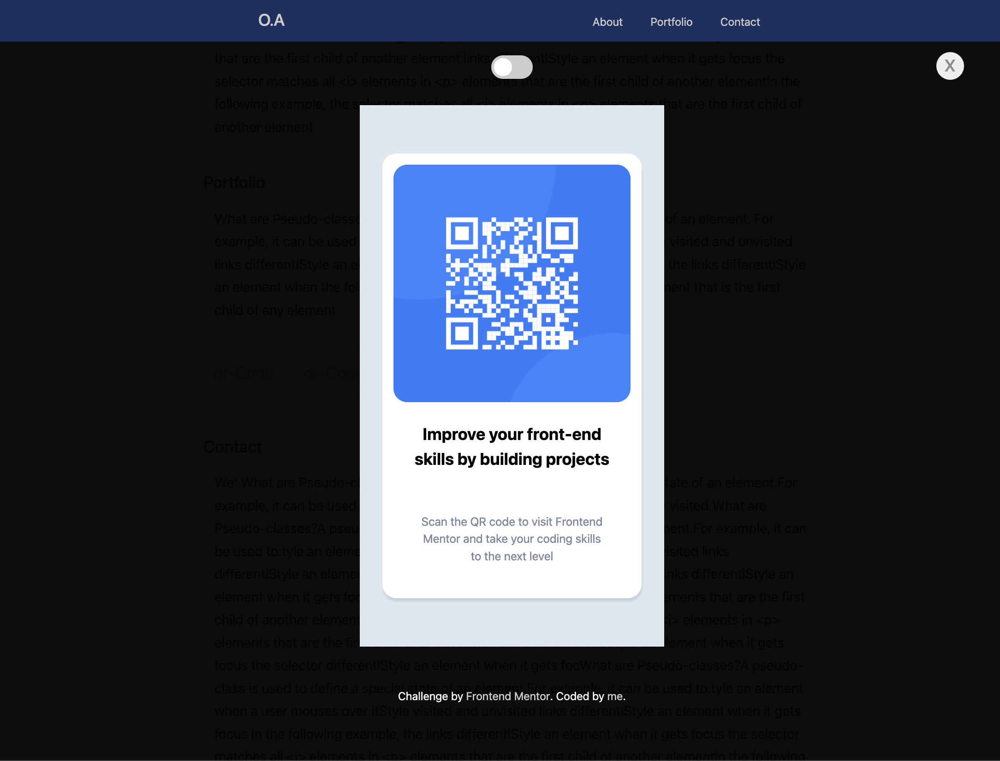

# Frontend Mentor - QR code component solution

This is a solution to the [QR code component challenge on Frontend Mentor](https://www.frontendmentor.io/challenges/qr-code-component-iux_sIO_H).

## Table of contents

- [Overview](#overview)
  - [Screenshot](#screenshot)
  - [Links](#links)
- [My process](#my-process)
  - [Built with](#built-with)
  - [Useful resources](#useful-resources)
- [Author](#author)

## Overview

### Screenshot

#### Mobile Design

#### Desktop Design

### Links

- Solution URL: [https://github.com/amochuko/qr-code](https://github.com/amochuko/qr-code)
- Live Site URL: [https://amochuko.github.com/projects/qr-code](https://amochuko.github.com/projects/qr-code)

## My process

### Built with

- Typescript
- Semantic HTML5 markup
- CSS custom properties
- Flexbox
- Mobile-first workflow
- Webpack

### Useful resources

- [w3Schools](https://www.w3schools.com/css) - This helped me for flex box reason. I really liked this pattern and will use it going forward.
- [MDN](https://developer.mozilla.org/css/flexbox) - This is an amazing article which helped me finally understand flexbox. I'd recommend it to anyone still learning this concept.

## Author

- Website - [amochuko](https://amochuko.github.com)
- Frontend Mentor - [@amochuko](https://www.frontendmentor.io/profile/@amochuko)
